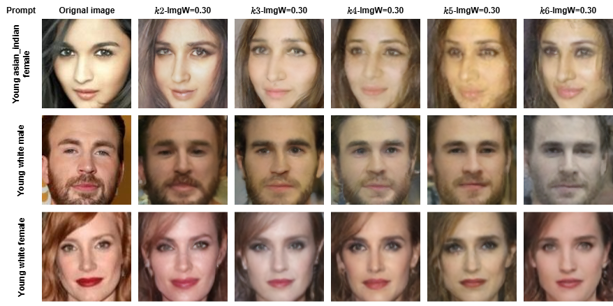

# Generative BlendPose-LDM: Utility-Preserving Face Image Anonymization via $k$-Anonymous Latent Diffusion

Generative BlendPose-LDM, a framework for face image anonymization that leverages $k$-anonymity privacy guarantees with the capabilities of diffusion models to recover image quality. Our approach takes uniformly blended pose-guided and class-consistent $k$-anonymous images as input and recovers their visual fidelity via diffusion-based denoising guided by text prompts aimed to preserve non-identifying demographic features and visual latents for downstream analysis.


<p align="center">
  
</p>


# Setup
1. Clone the repository.

```bash
git clone https://github.com/Mohammed-Horbi/Generative-BlendPose-LDM.git
```   
2. Download the diffusion model from Hugging Face
   The 5 GB model weights are hosted on Hugging Face:  
  👉 [MYS79/DDPM](https://huggingface.co/MYS79/DDPM)
```bash
from huggingface_hub import hf_hub_download

path = hf_hub_download(
    repo_id="MYS79/DDPM",
    filename="ddpm_500.pth"        
)
print("Saved at:", path)
```
# Usage
Place the downloaded diffusion model "ddpm_500.pth" in the cloned folder "Generative-BlendPose-LDM/models", and then start using the provided Demo.ipynb notebook.
